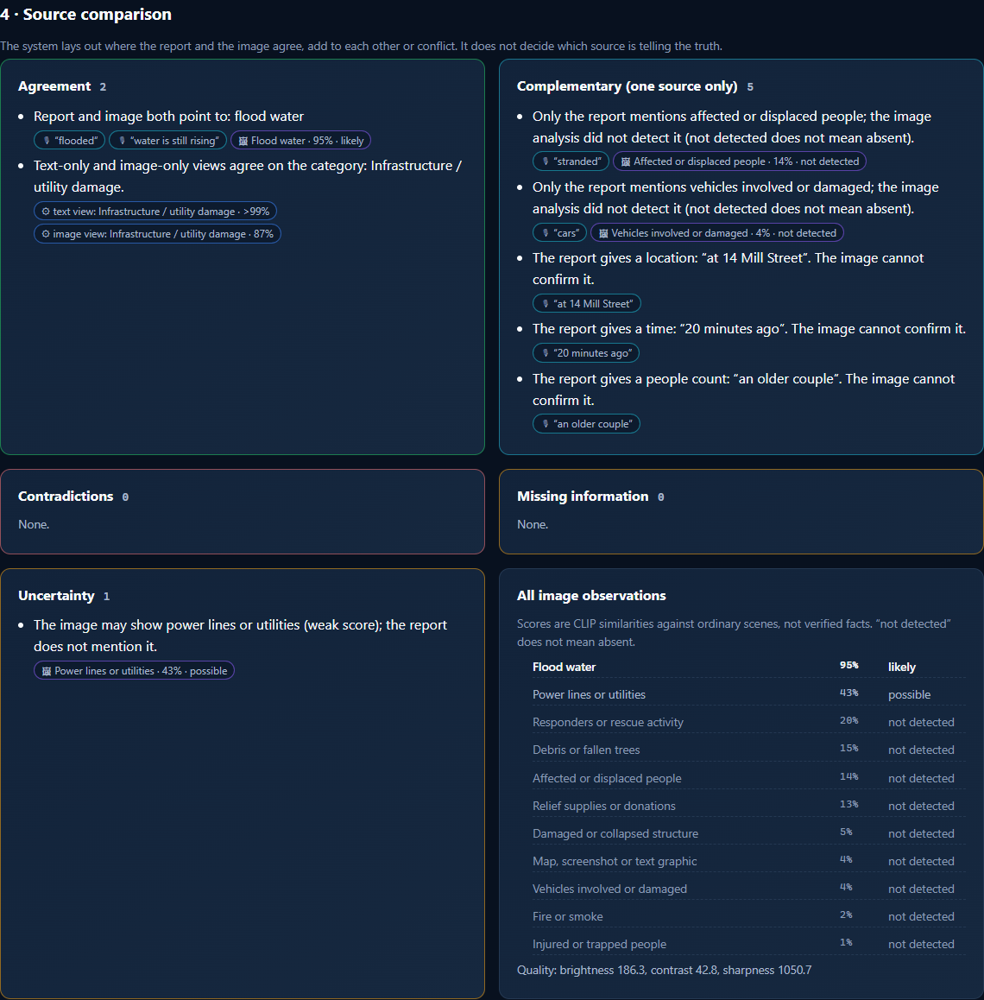
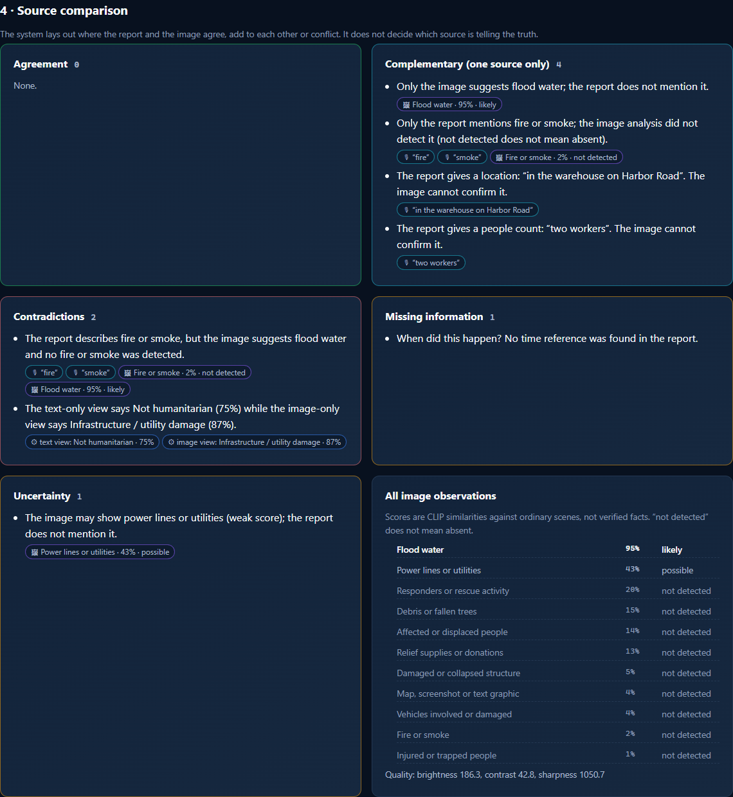
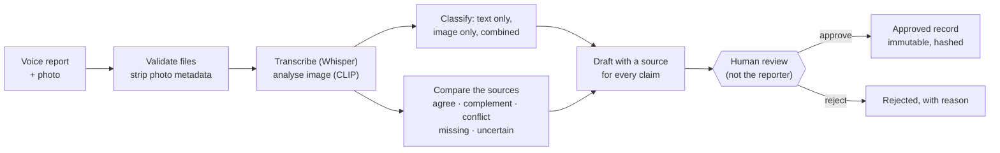

# Voice + Vision Incident Reporter

**A spoken incident report and a photo become a traceable draft. A person makes the final call.**
A local proof of concept: the app transcribes a voice report, analyses the scene photo, shows where the two sources
agree or conflict, and drafts an incident record in which every claim points back to its evidence. Nothing becomes a
record until a reviewer explicitly approves it.

## Explore the project

**[Project site](site/index.html)** (static page; open it from a local clone) ·
**[Demo video](site/media/demo.mp4)** (2:43, English captions) ·
**[Experiment results](docs/experiment-results.md)** · **[Demo guide](docs/demo-guide.md)**

[](docs/img/comparison.png)

## What it does

**The reporter** signs in, uploads a short voice recording and a photo of the scene, and gets back an analysed
incident. The page shows the transcript with the incident terms it found highlighted, next to the recording, so
recognition errors can be corrected. Corrections re-run the analysis, and the original transcript is kept. The
reporter then submits the incident for review.

**The app** compares the two sources and sorts what it found into five groups:

- **Agreement:** the report and the image point to the same thing, for example flood water.
- **Complementary:** only one source can speak to it. An address, a time or "an older couple" comes from the report;
  the image cannot confirm it. An image that does *not* show something is never treated as evidence against the report.
- **Contradiction:** both sources give positive, incompatible evidence. Both sides are shown; the app never picks one.
- **Missing information:** for example, no time is mentioned. This becomes a question for the reviewer.
- **Uncertainty:** weak image signals and unsure transcription are marked as such, not stated as facts.

It also classifies the incident three ways (from the text only, the image only, and both together) so disagreement
between the views is visible.

**The reviewer**, who must be a different person from the reporter, edits the category or summary, answers the open
questions, confirms they checked the evidence, and approves or rejects. Approval creates a hashed, immutable record.

## Why it matters

Incident reports increasingly arrive as a voice note plus a phone photo, and each can be wrong. Speech is misheard;
photos are old, reposted, partial or taken somewhere else. A system that merges both into one confident answer hides
exactly what a duty officer needs to see.

Take a report that says *"There is a big fire in the warehouse on Harbor Road … I think two workers are still
inside"*, sent with a photo that looks like a flooded street. Averaging the two would produce a tidy, wrong record. Instead the app lists
the conflict with both sides, sends the incident to review, and asks which account is right.



The transcript needs the same care. In the noisy demo recording, the recogniser heard "at 14 Mill Street" as "at 14
years" and stayed confident. The location silently disappeared from the draft. That is why the transcript sits next
to the audio for correction, and why a person approves the result.

## How it works



Everything left of the review step is machine output and can be wrong; the review step is the only way to an approved
record. Model errors, invalid output, missing input, unclear audio or images, conflicts and low confidence all send
the incident to review with a visible flag. Every upload, correction, edit and decision is written to a hash-chained
audit log. Models run on the local CPU; nothing is sent to an external service.
Details: [architecture](docs/architecture.md).

## What the research found

The classification question comes from two research papers (below): does text + image classify disaster posts better
than either alone? It was tested with a protocol fixed before any run, on the **same 955 held-out CrisisMMD
text–image posts** for all three views, with the test set scored once.

| View | Macro F1 |
|---|---:|
| Text only | 0.743 |
| Image only | 0.787 |
| **Combined** | **0.816** |

- Combining **reliably beats the text alone**: +0.073, 95% CI [+0.011, +0.143].
- Its advantage over the **image alone is not statistically reliable**: +0.029, 95% CI [−0.044, +0.093]. The
  pre-registered success criterion was therefore not met.
- When the text and image views disagree (191 of 955 posts), the combined view is right 63% of the time, against 94%
  when they agree. That is why the app shows disagreement instead of averaging it away.

Full results, per-class and per-event tables: [experiment results](docs/experiment-results.md).
What went wrong and why: [failure analysis](docs/failure-analysis.md).

## Speech evaluation (this project's extension)

Speech transcription, and everything built on it, is **this project's own extension**. The papers and CrisisMMD
contain no speech and establish nothing about spoken reports. It was evaluated separately, and **not on real
emergency calls**: on read audiobook speech and on fictional incident reports in synthetic voices.

- On LibriSpeech read speech, Whisper base.en reached **4.3% word error rate** (100 utterances, 37 speakers).
- On the scripted incident reports, clean audio gave 3.2% word error rate and heavy noise (0 dB) 25.0%. Under that
  noise, only **68%** of incident-critical words (places, times, counts, hazards) survived, and **51 of 96** drafts
  gained or lost a missing-information question.

Synthetic voices are clear and even-paced, so these numbers are an optimistic bound, not validated performance on real
callers. Detailed tables: [speech results](docs/experiment-results.md#speech-workflow-our-extension--not-a-paper-result).

## Run the local demo

After installing ([setup](docs/setup.md)), from the repository root on Windows:

```powershell
.\scripts\run_demo.ps1 -Seed      # demo accounts + five illustrative scenarios
```

Open **http://127.0.0.1:8000/login**. The demo usernames, what each role can do, and where the locally stored
password is: **[docs/LOCAL_DEMO_ACCESS.md](docs/LOCAL_DEMO_ACCESS.md)**. macOS/Linux: `scripts/run_demo.sh --seed`.

A fresh clone uses **zero-shot classifier heads**. The research models are trained locally from CrisisMMD and are not
distributed (the dataset's terms keep its contents confidential). Until you train them, the demo's classifications
can differ from the screenshots and the video, which were made with trained heads. The demo inputs are illustrative:
fictional reports in a synthetic voice, with public-domain photos of unrelated events.

## Trust and limits

- **Human review:** only a reviewer can approve, never the incident's creator, and only after confirming the evidence
  and answering or acknowledging open questions. The system never approves anything itself.
- **Traceability and audit:** every claim links to transcript words, image scores or model outputs; every action is in
  a tamper-evident audit log that records ids, hashes and field names, not transcripts.
- **Local data:** uploads, database and logs stay in the git-ignored `var/`; no API keys, no cloud services.
- **Limits:** combining the sources is not reliably better than the image alone on this benchmark. Speech is untested
  on real callers, accents or phone audio. The categories are five humanitarian classes from 2017 Twitter posts, in
  English only. It is a local proof of concept, with no HTTPS or single sign-on.

More: [security, privacy and governance](docs/security-privacy-governance.md) · [testing](docs/testing.md)
(88 automated tests) · [architecture](docs/architecture.md) · [setup and reproduction](docs/setup.md).

## Research basis and credits

- **Primary paper:** Munia, Zhu, Nasraoui, Imran. *Differential Attention for Multimodal Crisis Event Analysis.* CVPR
  2025 Workshops (MMFM3). [arXiv:2507.05165](https://arxiv.org/abs/2507.05165) ·
  [authors' code](https://github.com/Munia03/Multimodal_Crisis_Event)
- **Secondary paper:** Pranesh. *Exploring Multimodal Features and Fusion Strategies for Analyzing Disaster Tweets.*
  W-NUT 2022, pp. 62–68. [ACL Anthology](https://aclanthology.org/2022.wnut-1.6/)

From the papers: the question of whether fusion beats single sources, the five-class CrisisMMD humanitarian
setup (both papers), and frozen CLIP encoders with guided and differential-attention fusion (primary paper). A head
inspired by that fusion was also tested (Macro F1 0.801, no change to the answer). **Original to this
project:** the voice workflow, source comparison, traceable drafts, human approval, the app itself, and the speech
evaluation. The papers' numbers were not reproduced. Mapping: [paper mapping](docs/paper-mapping.md) ·
[contributions](docs/contributions.md).

- **Dataset:** CrisisMMD v2.0, Alam, Ofli, Imran, ICWSM 2018; agreed-label split from Ofli, Alam, Imran, ISCRAM 2020
  ([crisisnlp.qcri.org/crisismmd](https://crisisnlp.qcri.org/crisismmd)). Used for research on humanitarian computing
  only; its contents are confidential and are not in this repository ([dataset](docs/dataset.md)).
- **Speech data:** LibriSpeech test-clean, CC BY 4.0 ([openslr.org/12](https://www.openslr.org/12)).
- **Photos:** FEMA (Jocelyn Augustino; FEMA News Photo) and NPS, public domain. **Voices and narration:** synthetic,
  Kokoro-82M (Apache-2.0). Full details: [demo/CREDITS.md](demo/CREDITS.md).
- **Music in the demo video:** "Dreamer" Kevin MacLeod (incompetech.com)
  Licensed under Creative Commons: By Attribution 4.0 — https://creativecommons.org/licenses/by/4.0/
  (excerpt, trimmed, volume lowered and ducked under the narration, fades added). [Media licenses](docs/media-licenses.md).

## Contact

Oren Salami — [AI Systems Portfolio](https://nfc4u.co.il/Salami/Ai-Systems-Portfolio/) ·
[GitHub](https://github.com/Oren1984) · [LinkedIn](https://www.linkedin.com/in/oren-salami-b2988a224/)
