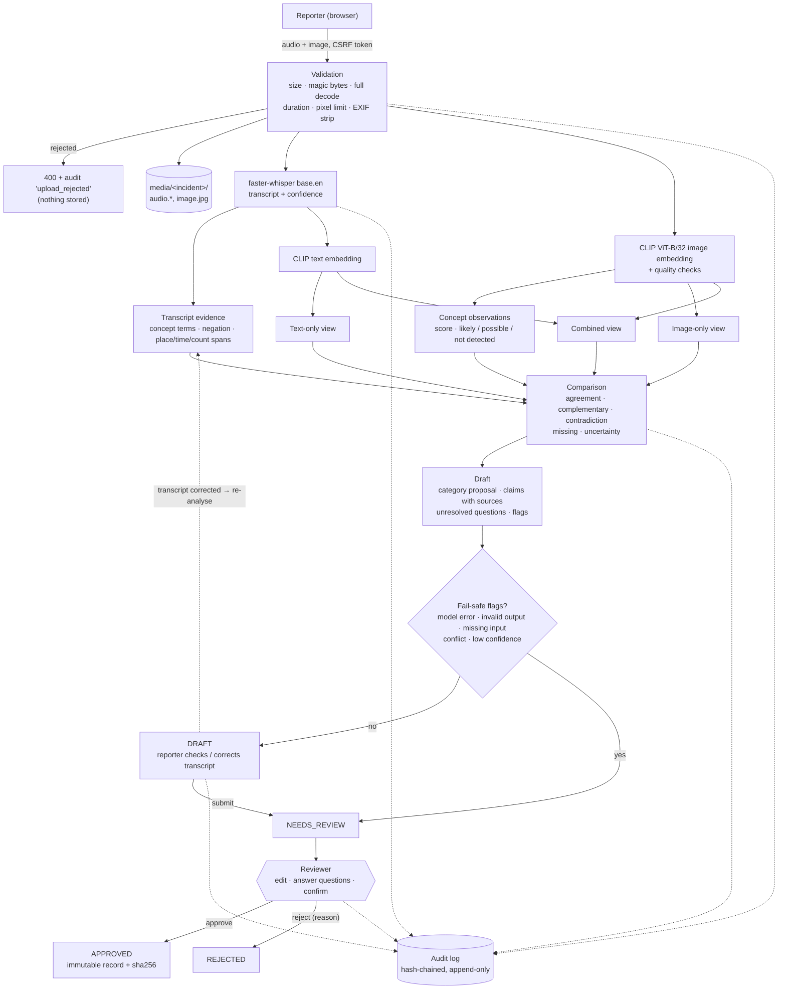

# Architecture and data flow

One Python process, one SQLite file, one media folder, local models on the CPU. No queue, no external service,
no cloud dependency at run time (models are downloaded once).



## Components (code map)

| Concern | Module | Notes |
|---|---|---|
| Settings | `incident_reporter/config.py` | `VVIR_*` environment variables; limits in `Limits` |
| Web layer | `incident_reporter/web.py`, `templates/`, `static/` | FastAPI + Jinja2 (autoescaped), no JS framework; CSP forbids inline script/style |
| Accounts, sessions, CSRF | `incident_reporter/security.py` | PBKDF2 (600k), random session tokens stored hashed, per-session CSRF token |
| Upload validation, storage | `incident_reporter/media.py` | magic-byte sniffing, PyAV decode, Pillow verify+load, re-encode without metadata, id-validated paths |
| Models | `incident_reporter/models.py`, `ml/clip_backbone.py`, `ml/heads.py` | lazy loading; output validators; heads are plain arrays (`.npz`, no pickle) |
| Transcript evidence | `incident_reporter/evidence.py`, `concepts.py` | literal lexicon + negation window + regex fields, all with character spans |
| Comparison | `incident_reporter/compare.py` | five buckets; never picks a winner |
| Draft | `incident_reporter/draft.py` | claims → sources; questions from conflicts, gaps, critical uncertainty |
| Workflow / state machine | `incident_reporter/workflow.py` | the only place that changes status; approval boundary |
| Storage | `incident_reporter/db.py` | SQLite (WAL); triggers make `approved_records` immutable and `audit_events` append-only |
| Audit | `incident_reporter/audit.py` | sha256 chain over every event; `verify()` |
| Observability | `incident_reporter/observability.py` | JSON logs with request id; counters; duration p50/p95 |
| Experiment | `experiments/` | prepare → features → select (dev) → test (once); S3; speech SP1–SP3 |

## Repository layout

```
incident_reporter/   the application: web layer, workflow/state machine, validation, models, evidence, comparison, draft, audit
experiments/         pre-registered experiment: prepare, features, RQ1, S3, observation check, post-hoc checks, speech SP1–SP3
results/             aggregate results only (JSON), no CrisisMMD content
tests/               pytest suite (stub models)
demo/                illustrative inputs (synthetic-voice reports, public-domain photos) + CREDITS
eval_data/speech/    project-authored scripted reports for SP2
tools/               demo seeding, screenshot/video capture, video assembly, results and site rendering
scripts/             run_demo.ps1 / run_demo.sh
site/                static project site and demo video
docs/                design, results, security, testing, setup and demo documentation
```

Git-ignored local state: `.venv/`, `.cache/` (dataset, features, models, audio), `artifacts/` (CrisisMMD-trained heads)
and `var/` (app databases, uploads, logs, demo credentials).

## States

| State | Entered when | Who can act |
|---|---|---|
| `DRAFT` | analysis finished without fail-safe flags | reporter (correct transcript, submit); reviewers can view |
| `NEEDS_REVIEW` | reporter submitted, **or** any fail-safe flag | reviewer (edit, answer, approve, reject); reporter can still correct the transcript |
| `APPROVED` | a reviewer approved with explicit confirmation | nobody — terminal, record immutable |
| `REJECTED` | a reviewer rejected with a reason | nobody — terminal |

Every state-changing request carries the incident `version`; a stale version gets HTTP 409 so a reviewer
never approves something other than what they saw.

## Inference views

All three views use the same frozen CLIP ViT-B/32 embeddings (512-d, L2-normalised) and a linear softmax head:

- **text only** — head over the transcript embedding;
- **image only** — head over the image embedding;
- **combined** — head over the concatenation `[text ; image]`.

Heads come from `artifacts/heads/crisismmd_heads.npz` when the experiment has been run locally (trained on
CrisisMMD, never committed), otherwise from **zero-shot** CLIP prompts (`labels.ZERO_SHOT_PROMPTS`). The UI and
`/healthz` say which one is active. Zero-shot combined = mean of the two single-source probability vectors.

## Image observations

For each concept (fire/smoke, flood water, structural damage, debris, power lines, vehicle damage, injured
people, displaced people, responders, relief supplies, map/screenshot), the image embedding's cosine similarity
to the best concept prompt is compared with its similarity to the best of five "ordinary scene" prompts. The
margin is squashed with a logistic curve (margin 0.04 → score 0.5, width 0.02) into a display score. Bands:
**likely** ≥ 0.60, **possible** 0.35–0.60, **not detected** < 0.35. Curve and thresholds were set by hand on the
demo photos — they are not calibrated probabilities. A first version (softmax against the background prompts
only) put almost every concept near 1.0 and was replaced for that reason. Ranking quality on CrisisMMD dev is
reported in [`experiment-results.md`](experiment-results.md). "Not detected" never counts as evidence of absence.

## Data kept

| Data | Where | Why |
|---|---|---|
| Original audio bytes | `var/media/<id>/audio.<ext>` | reviewer must be able to listen |
| Image, re-encoded without metadata | `var/media/<id>/image.jpg` | reviewer must see it; original with EXIF is discarded |
| Original and corrected transcript | `incidents` table | evaluation and audit of transcription errors |
| Analysis, draft, revisions | `incidents`, `draft_revisions` | traceability of what the machine proposed and what people changed |
| Approved record + sha256 | `approved_records` (immutable) | the "approved record" |
| Audit events | `audit_events` (append-only, hash chain) | who did what, when; no raw report text |
| Logs | `var/logs/app.jsonl` | operations; no raw report text |

`var/` is git-ignored. Deleting an incident's data is a manual operation on this POC (see the security doc).
